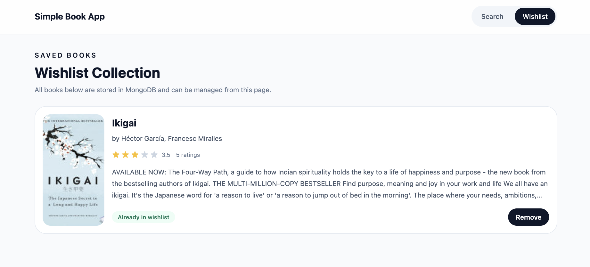

# Simple Book Search App

A mini full-stack book search application.

## Features

- Search books by keyword using Google Books API
- Display book title, thumbnail, authors, and rating
- Save books into a wishlist
- Remove books from wishlist
- Persist wishlist data with MongoDB
- Responsive UI built with React and Tailwind CSS
- Docker support for local development

## Tech Stack

### Frontend
- React
- TypeScript
- Vite
- Tailwind CSS
- React Router

### Backend
- Node.js
- Express
- TypeScript
- MongoDB
- Mongoose

## Project Structure

```bash
simple-book-app/
  frontend/
  backend/
  docker-compose.yml
```

## Local Setup

### 1. Backend

```bash
cd backend
cp .env.example .env
npm install
npm run dev
```

### 2. Frontend

```bash
cd frontend
cp .env.example .env
npm install
npm run dev
```

## Docker Compose

Start services from the project root:

```bash
npm run docker:up
```

Stop services:

```bash
npm run docker:down
```

## Screenshots
##### Search Page
[](https://raw.githubusercontent.com/shagaranasution/simple-book-app/refs/heads/master/screenshots/ss_1.png)

###### Wishlist Page
[](https://raw.githubusercontent.com/shagaranasution/simple-book-app/refs/heads/master/screenshots/ss_2.png)
